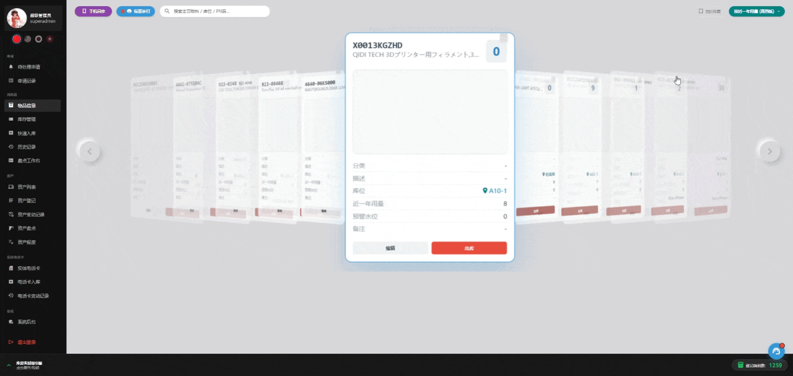
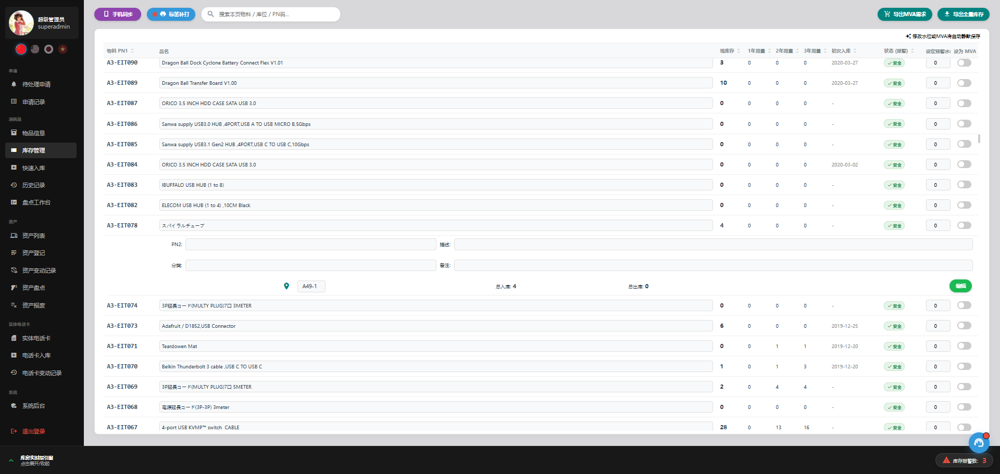
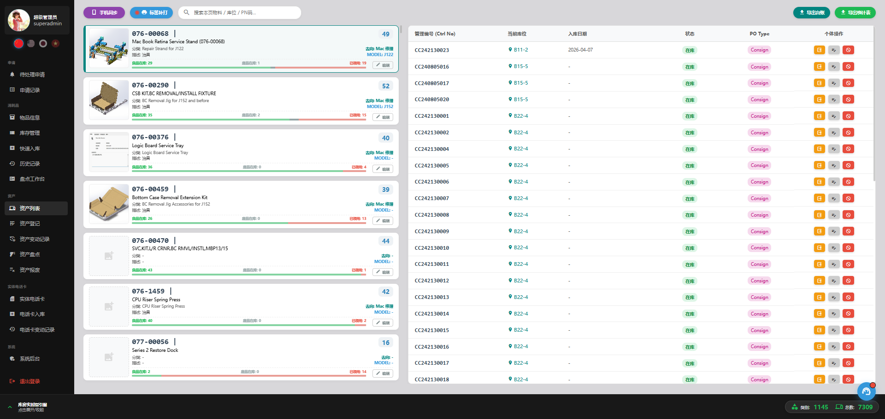

# WMS 可视化资产管理系统
> 一个基于 FastAPI + SQLModel 驱动，拥有 **3D CoverFlow 交互体验** 的现代化全栈仓储管理系统。旨在解决企业耗材流动与固定资产调拨的追踪难题，提供极速搜索、流式审批与可视化库位定位。






---

## 核心功能

本系统采用双轨制管理, 低价值库存数量管理 / 高价值资产位置管理。覆盖了入库 -> 上架 -> 管理 -> 使用 -> 盘点 -> 报废 整个生命周期;

- **动态3D卡片视图**: 主要信息呈现在轮播卡片上，卡片背面提交表单，支持滚轮/触摸板/按钮翻页

- **需求报警与定期采购**: 可通过管理页面进行报警水位设定，并可设定为定期采购项目。一键导出采购清单。

- **用户书签**: BookMark 存于数据库，即使更换设备也能显示所有书签。

- **入库校验**: 入库界面支持从Excel Ctrl+V，附带校验功能，防止料号重复。资产可自动发号，防止SN重复。

- **标签打印机**: 可联动标签打印机，发号时自动打印，或者手动补充打印。

- **流式审批工作流**:
    - 普通用户可发起 耗材领用/资产借用/归还/报废申请。
    - 管理员拥有专属审批队列，支持异步无感审核与一键驳回，自动核减实际库存。

- **移动端**: 可通过扫码登录手机Web端，进行 审批 / 盘点 / 拍照上传 操作。

- **可视化库位联动**: 全局整合地图，由底部抽屉展开，联动物品的位置信息，点击即可弹出地图并聚焦对象。

- **数据导出**: 库存可下载为Excel，资产库存可下载**全量数据**或**统计数据**

- **防呆校验安全机制**: 
    - 长时间无操作自动锁屏，解锁后强制刷新页面，防止前后端数据不匹配。
    - 报废需要滑动解锁，防止误触导致物品丢失。
    - 出库强制清点库存，防止虚空出库，并可自动修正库存。
    - 支持操作回溯，可以安全撤销某一笔出库。
    - 出/入/报废/修正/撤销 均留存记录。

- **全局极速搜索**: 

- **完整的盘点工作流**: 盲盘 + 对照 盘点同时可修正数量与库位，无需二次操作。

- **多语言切换**: 支持 简中/日/英/越南 四种语言。

- **超管后台**: 利用超级管理员账户可进行账号开通，数据导入覆写数据库，编辑地图操作。

- **后台操作限制**: 超级管理员账号唯一且限制IP登录，利用心跳机制检测当前登录状态，登录后锁死。异地登录将被限制并在本地提示。防止数据冲突。

## 技术栈

- **Backend:** Python3, FastAPI, SQLModel
- **Frontend:** HTML5/CSS3/Vanilla JavaScript, Jinja2
- **Libraries/Tools:** Cropper.js, Pandas + Openpyxl
- **I18N:** 自定义多语言翻译系统 (中/英/日/越南)

---

## 快速开始

### 环境要求
- Python 3.10+
- 推荐使用虚拟环境

### 安装步骤
```bash
# 1. 克隆项目
git clone [https://github.com/yourusername/wms-system.git](https://github.com/yourusername/wms-system.git)

# 2. 进入目录并安装依赖
cd wms-system
pip install -r requirements.txt

# 3. 初始化数据库 (初次运行)
python init_db.py

# 4. 启动 FastAPI 服务
uvicorn main:app --reload --host 0.0.0.0 --port 8000

# 5. 浏览器访问 https://127.0.0.1  默认超管账号: superadmin  PW: superadmin
```

## TODO

系统正处于向 **“主动调度型智能 WMS”** 演进的阶段，接下来的核心目标是深度对接 ERP 制造执行系统：

**1. ERP 系统深度集成 (API Integration)**
- [ ] **工单下发 Webhook (ERP -> WMS)**：接收工单号 (Order ID)、产品型号、所需消耗品清单及数量。
- [ ] **缺料拦截与预警 API (WMS -> ERP)**：当工单所需原料不足时，主动向 ERP 推送工单暂停/预警信号。
- [ ] **自动采购申请 (WMS -> ERP)**：库存触底时，自动组装采购请求并推送至外部采购系统。
- [ ] **采购状态回传 Webhook (ERP -> WMS)**：实时同步 ERP 端的审批进度与预计交期。

**2. 数据库架构升级 (Schema Expansion)**
- [ ] **智能补货字段**：扩充 `min_stock_level` (安全库存预警线)、`order_qty` (标准请购量)、`on_order_qty` (在途数量，利用“在途锁”防止重复 PO)。
- [ ] **BOM 管理 (Model-Recipe)**：新增产品配方表，支持 WMS 端独立拆解产品所需的底层物料清单。
- [ ] **工单异常挂起机制**：新增 `OrderIdle` 表，用于暂存因缺料无法齐套发料的生产工单。
- [ ] **执行追溯**：新增工单执行日志表，记录每一笔自动化扣库的流水详情。

**3. 核心业务逻辑增强 (Backend Logic)**
- [ ] **BOM 级自动扣库 (强事务)**：工单下发时自动遍历 Recipe。若库存不足，触发回滚、写入 `OrderIdle` 挂起，并拦截 ERP 流程。
- [ ] **全局水位监测**：重构 `update_single_usage` 函数，使自动扣库与手动领用/报废一样，触发底层的安全水位检测与自动 PO 评估。
- [ ] **一键入库**：增加前端对 ERP 回货状态的确认机制，点击确认收货即可自动完成入库流水。
- [ ] **异步任务流 (Background Tasks)**：将所有向 ERP 发送网络请求的动作剥离出主线程，放入后台异步执行，保障前端交互的极速响应。

**4. 前端与可视化交互 (UI/UX)**
- [ ] **自动化参数配置**：在库存手风琴明细表中增加 `min_stock_level`、`order_qty` 的可视化编辑模块（兼容纯手动与全自动管理模式）。
- [ ] **产品配方 (Recipe) 维护面板**：新增可视化的 BOM 关联与编辑页面。
- [ ] **在途订单控制台 (PO Dashboard)**：展示当前系统发起的采购申请、ERP 承认状态、预计到货时间，并支持修改未承认的订单。
- [ ] **生产数据看板**：在首页仪表盘增加图表，直观展示近期生产型号趋势、工单消耗排名及物料缺口。


### Developed by Gufenghuimou